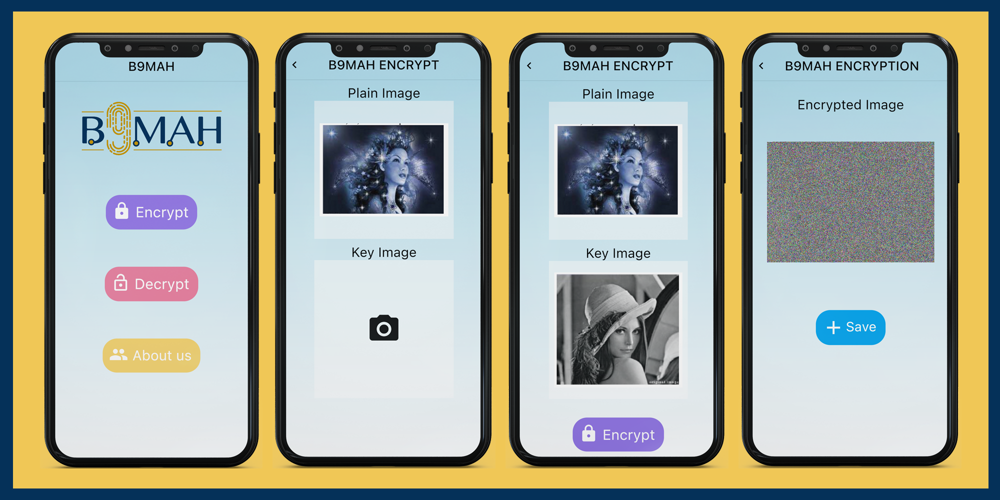

    

# image_encryption (B9mah) :

In this project we have proposed a new algorithm for images Encryption with high efficiency compared to previous algorithms. In this project we have developed a mobile-based application for smart devices that will be used for easily encrypting the images send over unsecure channels. This application will allows us preserve one of the most important data, which is the images by encrypting them using the proposed encryption algorithm. This algorithm is Achieving a high level of security and it uses the shortest time of encryption.

Senior project - King Abdulaziz University - Faculty of Computing & Information Technology in Rabigh - 2021-2022.

# Encryption Scheme : 

    

algorithm implement two-step of encryption: 1-Confusion. 2- Diffusion:

1- in confusion phase is to distract the high relationship between the pixel's units. Most of the confusion stages plan to permute the picture by changing the pixel positions without altering pixel values, so the histograms of the encrypted image and the plain image are identical. They are unreliable , Since the histogram is a measure of an image's essential characteristics, the attacker may use it to approximate the original image's content. In addition to, these methods restricted to image size specification and need multiple iterations. 

 2 - in the diffusion phase the pixel values are modified so that a slight shift in one pixel affects as many pixels as possible. In other words, all pixels should be mixed somehow. 

# The Result :

    

# Download:

https://play.google.com/store/apps/details?id=com.bsmahApp.image_encryption

